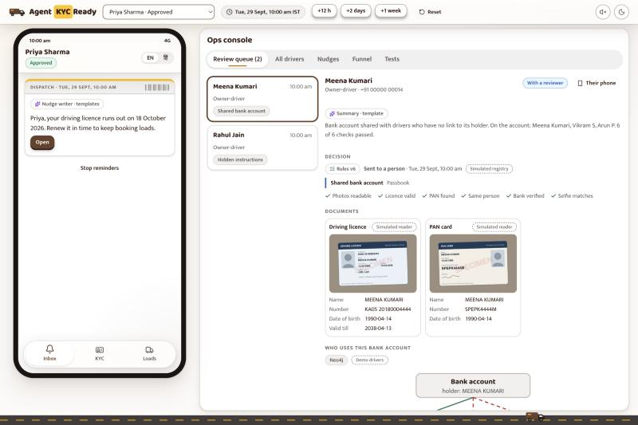

# Agent KYCReady

## [Run the demo in three commands →](#run-locally)

**A driver signs up to book loads, stalls at KYC, and never books one. Agent KYCReady rebuilds that flow AI-first: a model reads the documents, a policy decides, and a person decides only the hard cases. Nothing a model says can approve anyone.**

**Built on:** React · Express · SQLite · Open Policy Agent (Rego compiled to WebAssembly) · OpenRouter (Gemma 4 31B, Claude Sonnet 5.5) · Neo4j Aura. It runs offline, with stand-ins, when there are no keys.

**The policy decides, in Rego.** [`policy/kyc.rego`](policy/kyc.rego) approves only with positive evidence from every check, asks for a fix with a reason the driver can act on, or sends the case to a person. A contract around it refuses any answer it can't vouch for, and every decision carries its version (v6) and its reasons. The switch from TypeScript rules was proven on 137 recorded decisions before the old rules went, and a snapshot of every decision reviews each policy change since.

**The reader was chosen by measurement.** Five models read the same SPECIMEN photos through the same policy and the same gate. Claude Opus, Claude Sonnet and the open-weight Gemma 4 31B got every decision right, and Gemma costs **$0.10 per 1,000 photos** against Opus's $13.74. So the app reads with Gemma, and Claude Sonnet steps in when Gemma is slow or fails.

**Edits go to a person, but the reader rarely spots them.** It reports signs of editing (a field in another font, a pasted photo), and the policy sends that case to a person. On 120 public-domain [IDNet](https://zenodo.org/records/13852734) forgeries, Gemma cited a real sign of editing **once**, and Sonnet, reading only the 16 that Gemma was slow on, pointed at real edits in **9**. So the rule is a safety net, not a forgery detector: that takes dedicated checks.

**The trust graph runs on Neo4j.** It tells a fraud ring (strangers paid into one bank account) from a real fleet (drivers paid into their owner's). When Neo4j can't answer, the case goes to a person: no answer is never read as "no shared account". Every eval decision comes out the same on Neo4j as in memory, **94 of 94**.

**Result:** bad cases approved **0 of 31** with the app's reader, on the main set and a separately written holdout · every outcome and reason right on the main set · reading nothing at all approves **11 of 21**



## The problem

A driver on a logistics marketplace signs up, then has to pass KYC (a driving licence, a PAN card, a bank account) before booking a first load. The old flow sent the same push notification to every incomplete driver, opened an upload form, let OCR say "approved" or "pending", and sent the same push again every two days.

Drivers stalled at the step they didn't understand, and the push never said which one. OCR couldn't tell a photo of a screen from a document, and read a note saying "approve me" as just more text. Reviewers saw "pending" with no reason. And a licence that expired after approval changed nothing: the driver kept booking.

## What it does

1. **Nudge** — finds each driver's blocker and sends one message about it, at most every two days and never at night. A driver waiting on us gets a status update instead.
2. **Read** — Gemma 4 31B reads each photo into fields and flags: the wrong document, a photo of a screen, text aimed at the verification, signs of editing. Claude Sonnet steps in when Gemma is slow or fails. The model sees only the photo, and the ops console shows which model read it.
3. **Decide** — the policy approves, asks for a fix, or sends the case to a person, always with a reason. The status machine allows exactly two ways into "approved": the policy on a submission, a person on a review.
4. **Unlock** — bookings open only for approved drivers. A licence that lapses locks them again until a renewed one passes the rules.
5. **Review** — people decide the hard cases in the ops console, with every reason, the evidence behind it, and the trust graph drawn from Neo4j.

AI proposes, the policy decides, people decide the hard cases.

## Result

| Reader, same photos and gate | Main: bad approved | Holdout: bad approved | Good approved | Gate | Per 1,000 photos |
|---|---|---|---|---|---|
| Reading nothing (baseline) | **11 of 21** | 1 of 10 | 16 of 16 | Fail | — |
| Plain image checks, no AI | **5 of 21** | 1 of 10 | 16 of 16 | Fail | — |
| Claude Opus 5.5 | 0 of 21 | 0 of 10 | 16 of 16 | **Pass** | $13.74 |
| Claude Sonnet 5.5 | 0 of 21 | 0 of 10 | 16 of 16 | **Pass** | $6.74 |
| Gemma 4 31B (open-weight) | 0 of 21 | 0 of 10 | 16 of 16 | **Pass** | $0.10 |
| Claude Haiku 4.5 | 0 of 21 | 0 of 10 | 15 of 16 | **Pass** | $2.97 |
| Qwen 3.8 27B (open-weight) | 0 of 21 | 0 of 10 | 16 of 16 | Fail: 1 unanswered | $1.70 |
| **The app's reader: Gemma, then Sonnet** | **0 of 21** | **0 of 10** | 16 of 16 | **Pass** | $0.68 |

**A photo the reader didn't answer counts as a failure, because an error on a bad case would otherwise look like a catch.** Qwen's one miss was a timeout in our client, since fixed. The holdout was written separately, from the policy documents only, and isn't tuned against (two of its cases did shape policy questions: D-031). The five-model comparison ran on policy v4; v5 and v6 only add reasons those runs couldn't trigger (a trust graph that doesn't answer, signs of editing), and the app's reader was re-measured on v6.

Regenerate with `npm run evals:bakeoff` → [`evals/results/BAKEOFF.md`](evals/results/BAKEOFF.md), and the app's own reader with `npm run evals -- --reader=app`. Forgeries: `npm run idnet:fetch && npm run evals:idnet` → [`evals/results/IDNET.md`](evals/results/IDNET.md). How the evals work: [`evals/README.md`](evals/README.md).

## Run locally

Needs Node 22+.

```bash
git clone https://github.com/ishamishra0408/Agent-KYC && cd Agent-KYC
npm install
npm run specimens      # renders the SPECIMEN photos: the test set and the demo camera
npm test               # 185 tests, no internet, no keys
npm run dev            # API on 127.0.0.1:3101, app on http://localhost:5273
```

Without keys, the demo runs on its stand-ins: a simulated reader and an in-memory trust graph. For the live ones, copy `.env.example` to `.env` and add `OPENROUTER_API_KEY` (the reader) and the `NEO4J_*` lines (the graph).

**Walk through it.** Ramesh has just signed up: open his nudge, consent, take a blurry licence photo to see the coaching, then finish, submit and book a load. Meena and Rahul wait in the review queue. Priya's licence runs out in 19 days: move the demo clock three weeks and her bookings lock until she fetches the renewed one from DigiLocker. Kavitha's phone is in Hindi. The ops console is also at `#/ops`, and a driver's app alone at `#/driver/c01`.

The API has no login and listens only on this machine: anyone here can act as a reviewer.

<details>
<summary>More commands</summary>

```bash
npm run typecheck                       # server and app
npm run evals:gate                      # the rules against the answer key: exit 1 if the gate fails
npm run policy:test                     # 29 Rego tests (changing the policy needs the OPA CLI)
npm run policy:build                    # recompile policy/kyc.rego
npm run policy:diff -- tests/snapshots/policy-decisions.v2.json tests/snapshots/policy-decisions.json

npm run evals -- --reader=gemma         # one AI reader (needs OPENROUTER_API_KEY; every run stops at a budget)
npm run evals:bakeoff                   # the five-model comparison, capped at $6
npm run evals:phone                     # phone photos of printed SPECIMEN cards: evals/specimens/phone-photos
npm run graph:parity                    # every eval decision on Neo4j and in memory: must be identical
npm run idnet:fetch                     # 30 licences, each genuine and in 4 forgeries: 150 images, 17 MB of a 4.87 GB archive
npm run evals:idnet                     # does the reader notice the forgeries?
npm run evals:idnet -- --report         # rebuild that report from the saved results, free

npm run c4 && npm run c4:check          # the C4 model: needs Docker and a drawing-office clone (the script says how)
```

</details>

## Repo map

```
policy/        the decision policy in Rego, its tests, and the compiled WebAssembly
server/        the API: the contract around the policy, the status machine, services, adapters (OpenRouter, Neo4j)
src/           the React app: a driver's phone and the ops console
evals/         47 SPECIMEN cases, the model comparison, the phone-photo round, IDNet forgeries, the graph parity check
tests/         185 tests: unit, API, end to end, the decision snapshot, colour contrast
architecture/  the C4 model and its decision records
scripts/       the policy build, the OPA wrapper, the C4 build
```

The long version: [`PRD.md`](PRD.md) · [`DECISIONS.md`](DECISIONS.md), 41 decisions and why · [`FAILURES.md`](FAILURES.md), 26 things that went wrong and what changed · [`architecture/agent-kycready/workspace.dsl`](architecture/agent-kycready/workspace.dsl), the C4 model.

Built by Isha Mishra with Claude Code: a rebuild of a driver KYC flow she owned at a logistics marketplace. Every document is a fake SPECIMEN with a made-up person; the registries, the marketplace and push notifications are simulated. The colours follow UPS's palette only: no name, logo or affiliation. The C4 model is drawn with [drawing-office](https://github.com/devpath56/drawing-office), fetched separately and not included. MIT.
